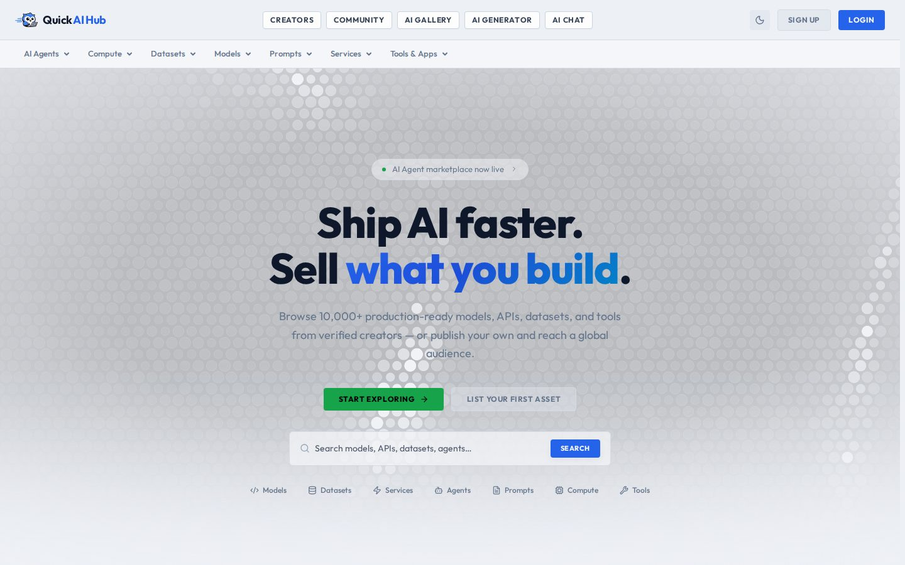

# QuickAIHub - Ship AI faster. Sell what you build.

**Website: [quickaihub.io](https://quickaihub.io)**  |  Project page: https://asansanwal.github.io/quickaihub.io/

Discover, sell and deploy AI models, datasets, tools, agents, prompts, compute and services. The marketplace for AI creators and buyers, with the AI agent marketplace now live.

## Highlights

- **Seven asset types** - AI agents, compute, datasets, models, prompts, services, tools and apps.
- **One-click deploy** - Run what you buy without leaving the platform.
- **Verified creators** - Publish your own assets and reach a global audience.
- **Real-time analytics** - Downloads, revenue and usage as they happen.
- **Flexible pricing** - Free, one-off or metered, set by the creator.
- **Live in three steps** - Sign up in seconds, browse or publish, ship and get paid.

## More projects

- [QuickPod](https://quickpod.io) - Affordable GPU and CPU rentals ([project page](https://asansanwal.github.io/quickpod.io/))
- [QuickOpen](https://quickopen.ai) - 100% AI-built open source software ([project page](https://asansanwal.github.io/quickopen.ai/))
- [Quick OS](https://quickopen.ai/aiquick-os) - A complete operating system that is actually yours ([project page](https://asansanwal.github.io/quickos/))
- [Common Screens](https://commonscreens.com) - Open web screenshot data ([project page](https://asansanwal.github.io/commonscreens.com/))
- [APIQuick](https://apiquick.io) - API marketplace for metered API integrations ([project page](https://asansanwal.github.io/apiquick.io/))
- [AIQuick](https://aiquick.io) - AI image, video and chat generation ([project page](https://asansanwal.github.io/aiquick.io/))
- [QuickDigital](https://quickdigital.io) - Premium digital goods and services marketplace ([project page](https://asansanwal.github.io/quickdigital.io/))
- [WebsiteTools](https://websitetools.io) - One workspace for website checks ([project page](https://asansanwal.github.io/websitetools.io/))
- [Vansha](https://vansha.com) - Free family genealogy portal ([project page](https://asansanwal.github.io/vansha.com/))
